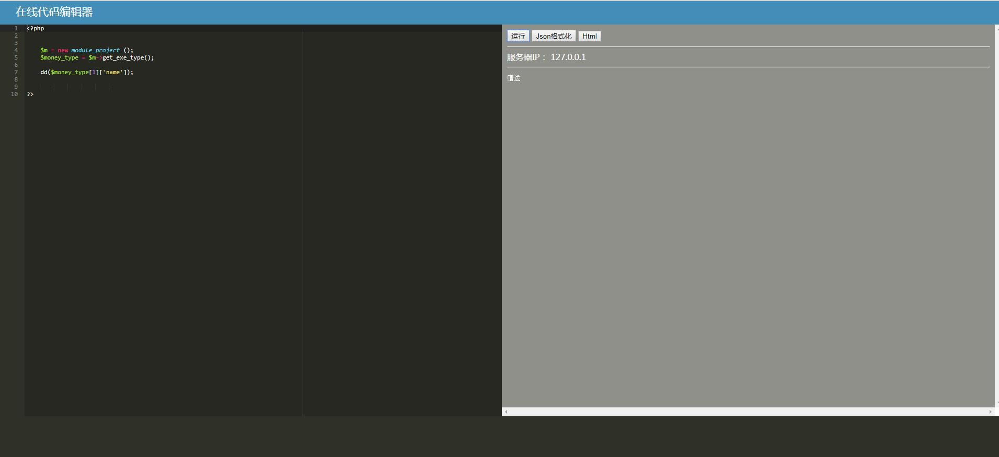

# codeEditor 可任意嵌入的PHP在线代码编辑器
# 用途
以PHP项目为例，假如线上系统出现问题，需要调试的话，一般情况下，我们会添加一些临时代码，
那么必然要经过：测试、提交代码至版本库、部署等一些列操作后才能生效，不仅如此，后期删除
还得走一遍流程，过程繁琐。如果您有这方面的烦恼，那么codeEditor便是您的不二之选


# 扩展
文本编辑器采用开源公共组件，为了节省空间只保留了php语言解析
其他语言，通过如下链接可获取
https://github.com/ajaxorg/ace-builds/tree/master/src-min-noconflict

# 接入方式

```php

    /**
    * 在任何一个PHP框架的控制器中，添加如下Action
    * 按照框架规则访问 URL?_token=sdkfdaaafnJHUqoa 即可渲染出编辑器
    */
    public function runcodeAction()
    {
        if($token = $_REQUEST['_token'] == 'sdkfdaaafnJHUqoa'){
        
                //如果是非自动加载，您需要自行require 类库文件ce.php
                $ce = new Leb_plugin_codeEditor_ce();
                $ce->show();
            }else{
                dd('未授权');
        }
    }
```

# 效果


